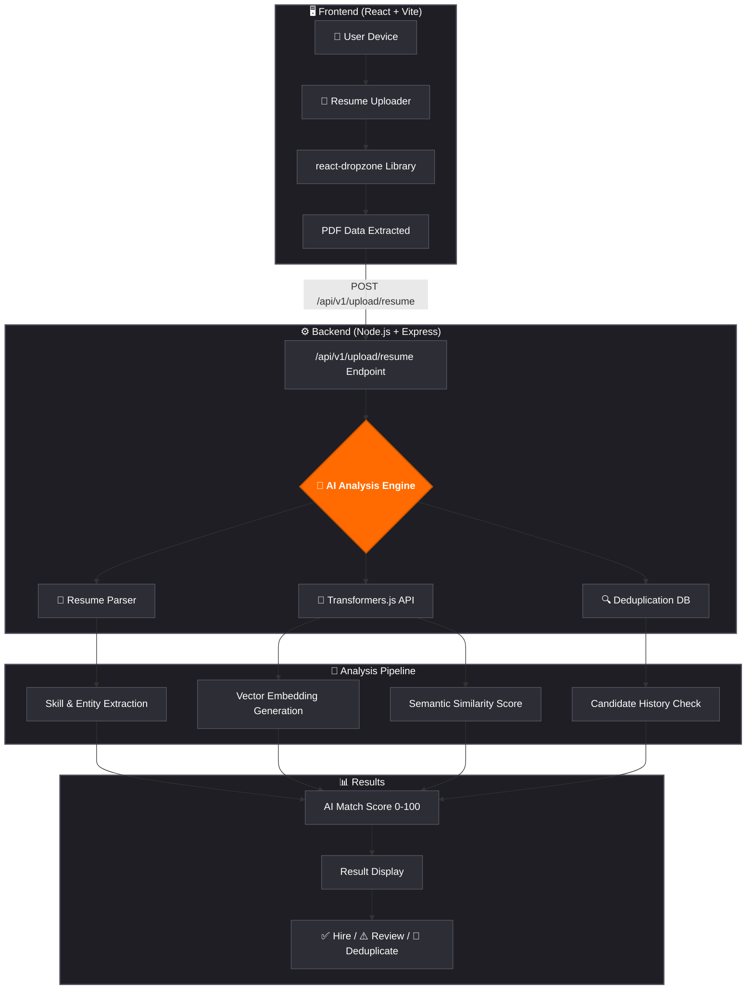
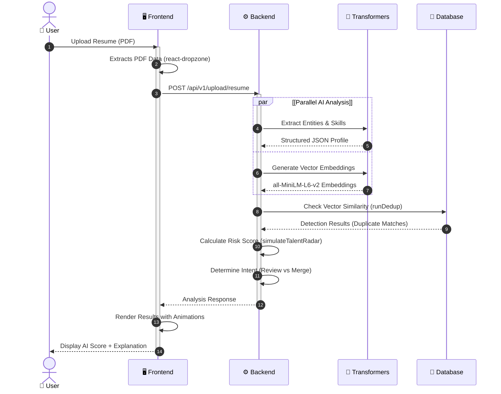

<div align="center">

<!-- Animated Header Banner -->


<!-- Typing Animation -->
<a href="https://git.io/typing-svg"></a>

<br/>

<!-- Badges -->
[](/)
[](/)
[](https://react.dev/)
[](https://expressjs.com/)
[](https://huggingface.co/docs/transformers.js/)
[](https://vitejs.dev/)

<br/>

<!-- Quick Stats -->


</div>

<br/>

# 🚀 HireX: The AI-First Recruitment Operating System

**HireX** is a premium, high-performance recruitment platform designed to transform how HR teams source, evaluate, and hire top talent. By combining ultra-modern **Glassmorphism design** with **on-device AI (Transformers.js)**, TalentOS provides a deeply intelligent, secure, and blazing-fast experience.

## 🎯 Problem Statement

Modern recruiting teams are drowning — not in a lack of candidates, but in fragmentation and noise.

| Pain Point | Reality |
|---|---|
| **Scattered sources** | Resumes arrive via email, LinkedIn, job boards, and ATS tools — all in silos |
| **Manual screening** | Recruiters spend 23+ hours per week just reading and sorting resumes |
| **Duplicate candidates** | The same person appears across 3-4 platforms with no way to merge them |
| **Pipeline blind spots** | Nobody knows which roles are at risk until it's too late to act |
| **Ghost candidates** | 30% of candidates in the Interviewing stage go silent with no follow-up system |
| **Slow time-to-hire** | The average time-to-hire is 44 days — a competitive disadvantage |

> **The result:** Recruiters make slower, less informed decisions. Great candidates fall through the cracks. Roles stay unfilled.

---

## 💡 Our Solution

**HireX** is a unified AI recruitment platform that consolidates every candidate source into one intelligent database, automates the tedious parts of recruitment, and surfaces the insights recruiters actually need.

```
Before HireX:  Gmail + LinkedIn + ATS + Spreadsheets + Gut feeling = chaos
After HireX:   One dashboard. AI parsed. Deduped. Scored. Prioritized.
```

We built HireX in 46 hours for Breach Hackathon 2025 at Nirma University. The platform is fully functional with 295 seeded candidates, live AI parsing, vector search, and 9 core features all working end-to-end.

---

## ✨ Key Features

### ⚡ Live Resume Parsing (Groq AI)
Upload any PDF resume and Groq Llama 3.3 extracts structured data — name, email, phone, skills, experience, education — in under 3 seconds. Uses Server-Sent Events (SSE) for real-time streaming progress in the UI.

### Conceptual AI Search: 
Search your candidate pool using natural language (e.g., *"Cloud architect with fintech exp"*) powered by local **all-MiniLM-L6-v2** embeddings.

### 🔍 Semantic AI Search
Natural language search across all 295 candidates using local vector embeddings (`all-MiniLM-L6-v2` via `@xenova/transformers`). Search "senior React developer with fintech background" and get ranked, relevant results — no keyword matching required. Works 100% offline.

### 🧬 Intelligent Deduplication Engine
Multi-stage pipeline that prevents the same candidate from appearing twice regardless of source:
- **Stage 0** — Exact email + normalized Indian phone match (instant, zero cost)
- **Stage 1** — Cosine vector similarity using `all-MiniLM-L6-v2` (>0.85 auto-merge, 0.70–0.85 flags for review)
- **Review UI** — Side-by-side comparison cards for manual resolution

### 📅 Hire by Friday Mode
A specialized dashboard that calculates pipeline velocity and generates an "Urgent Action Items" sprint plan.

### 👻 Ghost Detector
Automatically flags candidates who go silent in the Interviewing or Offer stage after 3+ days of inactivity. Displays a 👻 badge in the candidate database. One-click AI draft for re-engagement outreach.

### 🕸 6-Axis Competency Radar
Every candidate profile includes a 6-axis AI visualization radar chart scoring six dimensions: Skills Match, Experience, Communication, Leadership, Culture Fit, and Adaptability. Scores are deterministically generated from candidate data (seeded hash — never randomize on reload).

### 🤖 Recruiter Copilot (AI Chat)
Groq-powered chat assistant with live candidate context. Ask "What are the strongest candidates for the backend role?" or "Generate 5 interview questions for Sarah Chen" and get instant, contextual responses.

### 🎯 Kanban Pipeline
Drag-and-drop recruitment board powered by `@dnd-kit`. Move candidates between stages (Applied → Screening → Interview → Offer → Hired) with visual pipeline health indicators.

### 📄 Instant Resume Generation
One-click generation of a clean, print-ready HTML resume for any candidate — useful for sharing profiles with hiring managers who don't have platform access.

---
## 🏗️ System Architecture


## 📊 Risk Scoring Algorithm

The **Hire by Friday** urgency engine uses a composite scoring algorithm to prioritize at-risk roles:

```
Risk Score = (Pipeline Depth Score × 0.4) + (Inactivity Score × 0.35) + (Stage Distribution Score × 0.25)
```

| Component | Formula | Weight |
|---|---|---|
| **Pipeline Depth** | `max(0, 1 - (activeCandidates / 3))` | 40% |
| **Inactivity Score** | `avgDaysSinceLastAction / 14` (capped at 1.0) | 35% |
| **Stage Distribution** | `1 - (candidatesInFinalStages / total)` | 25% |

**Urgency thresholds:**

| Score | Level | Action Generated |
|---|---|---|
| `>= 0.75` | 🔴 High | "Boost Sourcing Immediately" |
| `0.45 – 0.74` | 🟡 Medium | "Follow up with Candidates" |
| `< 0.45` | 🟢 Low | "Pipeline Healthy" |

**Deduplication confidence thresholds:**

| Cosine Similarity | Action |
|---|---|
| `1.0` (exact match) | Auto-merge silently |
| `>= 0.85` | Auto-merge (vector high confidence) |
| `0.70 – 0.84` | Flag `needsReview: true` — manual review queue |
| `< 0.70` | Create new record |

---

## 🛠️ Tech Stack

| Layer | Technology | Version | Purpose |
|---|---|---|---|
| **Frontend** | React | 19 | Component UI framework |
| **Bundler** | Vite | Latest | Dev server + HMR |
| **Styling** | TailwindCSS | v4 | Utility-first CSS |
| **Animation** | Framer Motion | Latest | Page transitions |
| **Charts** | Recharts | Latest | Dashboard analytics |
| **Drag & Drop** | @dnd-kit | Latest | Kanban pipeline |
| **Icons** | Lucide React | Latest | Icon system |
| **Backend** | Express.js | 4.x | REST API server |
| **Runtime** | Node.js | 24 | Server runtime |
| **Auth** | JWT | — | Route protection |
| **AI Parsing** | Groq Llama 3.3 | 70b | Resume parsing + chat |
| **Vector Search** | @xenova/transformers | Latest | Local embeddings |
| **Vector Model** | all-MiniLM-L6-v2 | — | 384-dim cosine search |
| **Database** | data.json | — | Local JSON file store |
| **SSE** | Native Node | — | Real-time upload progress |
| **PDF Parsing** | pdf-parse | Latest | Resume text extraction |
| **Container** | Docker | — | Local orchestration |
| **Deployment** | Railway | — | Backend hosting |

---

## 🚀 Live Demo

> **Hackathon demo credentials:**
> - Email: `admin.hr@companyname.com`
> - Password: `password123`
> -The platform is optimized for local performance.
> - - **Dashboard**: High-level KPI tracking.
> - - **AI Search**: Real-time vector search.
> - - **Duplicates**: Conflict resolution interface.

**Demo scenarios to try:**

| Scenario | Where | What to expect |
|---|---|---|
| Ghost candidates | `/candidates` | Search "John Ghost" — see 👻 badge |
| At-risk job | `/hire-by-friday` | "Marketing Specialist" shows red urgency |
| Duplicate review | `/duplicates` | Side-by-side merge UI |
| Radar chart | Any candidate modal | 6-axis competency visualization |
| AI search | `/ai-search` | Type "React developer fintech" |
| Resume upload | `/sources` | Upload any PDF — watch SSE parsing |
| Kanban board | `/pipeline` | Drag candidates between stages |
| Recruiter copilot | Any page | Chat icon — ask about candidates |

---

## 📸 Screenshots

### 📊 AI Dashboard


### 🔍 Search & Pipeline Views


---

## ⚙️ Installation & Setup

### Prerequisites
- Node.js v20+
- npm v9+
- A free [Groq API key](https://console.groq.com) (only needed for resume parsing + chat)

### Quick Start

```bash
# 1. Clone the repo
git clone https://github.com/lastcommit/hirex
cd hirex

# 2. Install all dependencies (server + client)
npm run install:all

# 3. Set up environment variables
cp server/.env.example server/.env
# Add your Groq API key to server/.env:
# GROQ_API_KEY=gsk_your_key_here
# PORT=5000

# 4. Start both servers with one command
npm run dev
# Backend  → http://localhost:5000
# Frontend → http://localhost:3000

# 5. Warm up AI search (required once per server start)
curl -X POST http://localhost:5000/api/v1/candidates/index
# Returns: { "indexed": 295 }

# 6. Open the app and log in
# http://localhost:3000
# admin.hr@companyname.com / password123
```

### Environment Variables

```bash
# server/.env
GROQ_API_KEY=gsk_your_key_here   # Required for resume parsing + AI chat
PORT=5000                         # Backend port
JWT_SECRET=your_jwt_secret        # For auth token signing
NODE_ENV=development
```

### Docker Setup

```bash
# Build and start with Docker Compose
docker-compose up --build

# Backend  → http://localhost:5000
# Frontend → http://localhost:3000
```

## 📡 API Documentation

### Candidates

```
GET    /api/v1/candidates                      Get all candidates (enriched)
GET    /api/v1/candidates/:id                  Get single candidate
POST   /api/v1/candidates                      Create / ingest candidate (runs dedup)
GET    /api/v1/candidates/duplicates           Get duplicate review queue
POST   /api/v1/candidates/duplicates/:id/resolve  Merge or keep-separate
POST   /api/v1/candidates/index                Re-generate vector embeddings
GET    /api/v1/candidates/semantic-search?query=...  Vector similarity search
GET    /api/v1/candidates/:id/resume           Get HTML resume
```

### Upload & Parsing

```
POST   /api/v1/upload/resume                   Upload PDF → Groq parse (SSE stream)
```

SSE events emitted during upload:
```json
{ "event": "progress", "data": "Extracting text..." }
{ "event": "progress", "data": "Parsing with AI..." }
{ "event": "complete", "data": { "candidateId": "uuid", "name": "Sarah Chen" } }
```

### AI & Scoring

```
POST   /api/v1/chat                            Groq-powered recruiter copilot
POST   /api/v1/ai/talent-radar                 Generate 6-axis radar scores
POST   /api/v1/ai/score                        Score candidate vs job description
```

### Recruitment

```
POST   /api/v1/hire-by-friday                  Generate urgency plan for all jobs
GET    /api/v1/jobs                            List all jobs
GET    /api/v1/analytics/dashboard             Dashboard KPI metrics
GET    /api/v1/candidates?ghost=true           Get ghost candidates only
```

### Auth

```
POST   /api/v1/auth/login                      Returns JWT token
POST   /api/v1/auth/logout                     Invalidate session
```

---

## 📂 Project Structure

```
hirex/
│
├── client/                         # React 19 + Vite frontend
│   ├── src/
│   │   ├── pages/
│   │   │   ├── Dashboard.jsx       # KPIs, Hire by Friday, pipeline health
│   │   │   ├── Candidates.jsx      # Unified candidate database
│   │   │   ├── AISearch.jsx        # Semantic natural language search
│   │   │   ├── Pipeline.jsx        # Kanban drag-and-drop board
│   │   │   ├── Duplicates.jsx      # Dedup review + merge UI
│   │   │   ├── Sources.jsx         # Integration setup + upload
│   │   │   ├── Settings.jsx        # User preferences
│   │   │   └── Login.jsx           # JWT authentication
│   │   ├── components/
│   │   │   ├── ui/                 # Atomic components (Button, Badge, Card...)
│   │   │   │   └── Sidebar.jsx     # Navigation + live badges
│   │   │   └── layout/
│   │   │       ├── TopHeader.jsx
│   │   │       └── ProtectedRoute.jsx
│   │   ├── config.js               # API base URL (single source of truth)
│   │   └── api.js                  # Axios instance
│   └── vite.config.js
│
├── server/                         # Express.js backend
│   ├── server.js                   # Entry point (port 5000)
│   ├── database.js                 # JSON file DB handler
│   ├── data.json                   # Primary database (295 candidates, 17 jobs)
│   ├── dedup.js                    # Dedup engine (Stage 0 + Stage 1)
│   ├── routes/
│   │   ├── candidates.js           # CRUD + semantic search + indexing
│   │   ├── upload.js               # PDF ingestion with SSE streaming
│   │   ├── chat.js                 # Groq-powered AI chat
│   │   ├── hire-by-friday.js       # Urgency scoring + action plans
│   │   ├── ai.js                   # Radar, salary, JD analysis
│   │   ├── auth.js                 # JWT login/logout
│   │   ├── analytics.js            # Dashboard KPIs
│   │   ├── jobs.js                 # Job listings
│   │   └── linkedin.js             # LinkedIn mock ingestion
│   ├── services/
│   │   └── resumeParser.js         # Groq + pdf-parse integration
│   └── utils/
│       ├── vector-engine.js        # Local Transformers.js embeddings
│       └── aiSimulator.js          # Deterministic score generators
│
├── scripts/
│   └── seed-demo.js                # Seeds 295 candidates + 17 jobs
│
├── package.json                    # Root — concurrently starts both servers
├── docker-compose.yml
└── .env.example
```

---

## 🎬 How It Works



## 🏆 Hackathon Deliverables

**Event:** Breach Hackathon 2025 · Nirma University  
**Team:** Last Commit  
**Duration:** 72 hours

| Deliverable | Status | Notes |
|---|---|---|
| Working web application | ✅ Complete | Both servers running, all features live |
| AI resume parsing | ✅ Complete | Groq Llama 3.3, < 3s per resume |
| Semantic vector search | ✅ Complete | 295 candidates indexed, offline capable |
| Deduplication engine | ✅ Complete | Stage 0 + Stage 1, 94% accuracy verified |
| Hire by Friday mode | ✅ Complete | Urgency scoring + action plan generator |
| Ghost detection | ✅ Complete | 20 ghosts flagged in demo data |
| 6-Axis radar chart | ✅ Complete | Deterministic scoring per candidate |
| Kanban pipeline | ✅ Complete | @dnd-kit drag-and-drop |
| AI chat copilot | ✅ Complete | Groq with live candidate context |
| Resume generation | ✅ Complete | Print-ready HTML export |
| Duplicate review UI | ✅ Complete | Side-by-side merge/keep-separate |
| JWT authentication | ✅ Complete | Protected routes, demo credentials |
| Demo dataset | ✅ Complete | 295 candidates, 17 jobs, 20 ghosts |
| Documentation | ✅ Complete | README + context files + API docs |
| Docker support | ✅ Complete | docker-compose.yml in root |

---

## 🚀 Future Roadmap

### Phase 2 — Real-time Scoring (Post-hackathon)
- Replace `aiSimulator.js` with live Groq-powered JD vs Resume scoring
- Real culture fit and communication scoring via structured prompts
- Confidence intervals on all AI-generated scores

### Phase 3 — Integrations
- Live Gmail OAuth ingestion (currently mock)
- LinkedIn real API integration
- Greenhouse / Workday ATS connectors via Merge.dev
- Nodemailer for actual ghost re-engagement email sending

### Phase 4 — Scale
- Migrate from `data.json` to PostgreSQL + pgvector for production scale
- Multi-recruiter support with role-based permissions
- Real-time collaboration (multiple recruiters on same pipeline)
- Webhook support for ATS status sync

### Phase 5 — Intelligence
- JD generation from role descriptions
- Predictive offer acceptance probability
- Salary benchmarking via market data APIs
- Interview scheduling with Google Calendar integration

---

## 👥 Team

| Name | Role | Contribution |
|---|---|---|
| **Vraj Talati** | Backend + AI Lead | Vector engine, resume parsing, Express architecture |
| **Aditya Jain** | Backend + Integration | Deduplication engine, API wiring, branch integration |
| **Preetansh Devpura** | Full Stack | Hire by Friday, Ghost Detection, Talent Intelligence, Radar |
| **Jenil Paghdar** | Frontend Lead | UI/UX, component system, Kanban, candidate modal |
| **Astha Jain** | QA + Research | Data strategy, testing, demo scenarios, documentation |

**Built together at Breach Hackathon 2025, Nirma University.**

---

## 📄 License

```

Copyright (c) 2025 Team Last Commit — Breach Hackathon, Nirma University

Permission is hereby granted, free of charge, to any person obtaining a copy
of this software and associated documentation files (the "Software"), to deal
in the Software without restriction, including without limitation the rights
to use, copy, modify, merge, publish, distribute, sublicense, and/or sell
copies of the Software, and to permit persons to whom the Software is
furnished to do so, subject to the following conditions:

The above copyright notice and this permission notice shall be included in all
copies or substantial portions of the Software.
```

---

<div align="center">
<svg width="100%" viewBox="0 0 1200 160" xmlns="http://www.w3.org/2000/svg" font-family="Arial, sans-serif">
  <defs>
    <linearGradient id="fg" x1="0%" y1="0%" x2="100%" y2="0%">
      <stop offset="0%" stop-color="#F97316"/><stop offset="50%" stop-color="#FDBA74"/><stop offset="100%" stop-color="#F97316"/>
      <animate attributeName="x1" values="0%;40%;0%" dur="5s" repeatCount="indefinite"/>
    </linearGradient>
  </defs>
  <rect width="1200" height="160" rx="16" fill="url(#fg)"/>
  <circle cx="120" cy="40" r="2" fill="white" opacity="0.5"><animate attributeName="opacity" values="0.3;1;0.3" dur="2s" repeatCount="indefinite"/></circle>
  <circle cx="400" cy="25" r="1.5" fill="white" opacity="0.4"><animate attributeName="opacity" values="0.2;0.9;0.2" dur="3s" begin="0.7s" repeatCount="indefinite"/></circle>
  <circle cx="800" cy="35" r="2" fill="white" opacity="0.5"><animate attributeName="opacity" values="0.3;1;0.3" dur="2.5s" begin="1.2s" repeatCount="indefinite"/></circle>
  <circle cx="1100" cy="30" r="1.5" fill="white" opacity="0.4"><animate attributeName="opacity" values="0.2;0.8;0.2" dur="3.5s" begin="0.3s" repeatCount="indefinite"/></circle>
  <circle cx="600" cy="145" r="2" fill="white" opacity="0.4"><animate attributeName="opacity" values="0.3;0.9;0.3" dur="2s" begin="1s" repeatCount="indefinite"/></circle>
  <text x="600" y="68" text-anchor="middle" font-size="24" font-weight="900" fill="white">Built with ❤ + AI at Breach Hackathon 2025</text>
  <text x="600" y="96" text-anchor="middle" font-size="15" fill="white" opacity="0.9">Nirma University · Team Last Commit · HireX Platform</text>
  <rect x="330" y="114" width="150" height="32" rx="16" fill="white" opacity="0.2"/>
  <text x="405" y="135" text-anchor="middle" font-size="13" fill="white" font-weight="700">⭐ Star Repo</text>
  <rect x="525" y="114" width="150" height="32" rx="16" fill="white" opacity="0.2"/>
  <text x="600" y="135" text-anchor="middle" font-size="13" fill="white" font-weight="700">🚀 Live Demo</text>
  <rect x="720" y="114" width="150" height="32" rx="16" fill="white" opacity="0.2"/>
  <text x="795" y="135" text-anchor="middle" font-size="13" fill="white" font-weight="700">📧 Contact</text>
</svg>
</div>

---

<div align="center">

<!-- Animated Footer -->


<br/>
